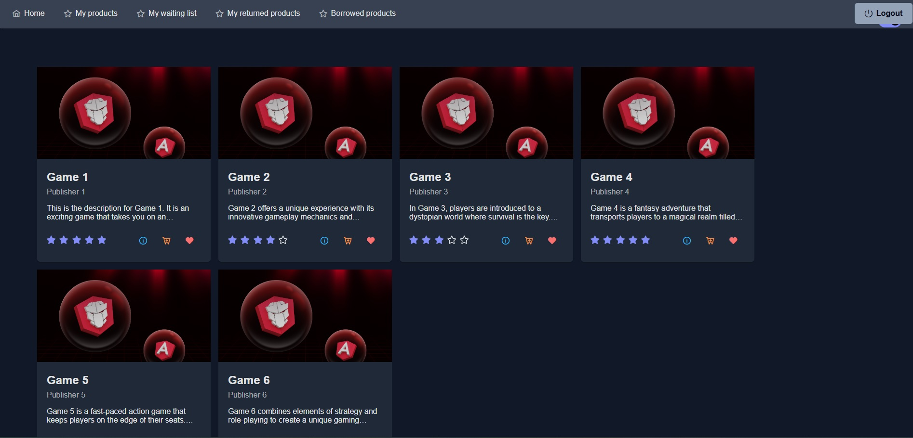
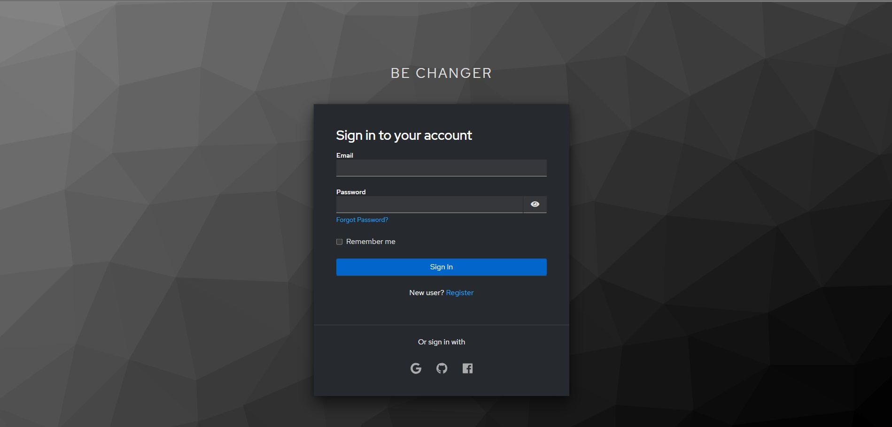
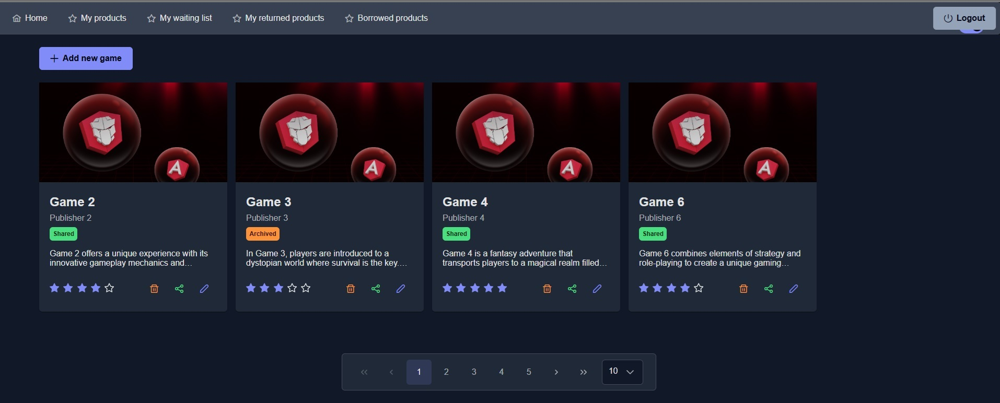
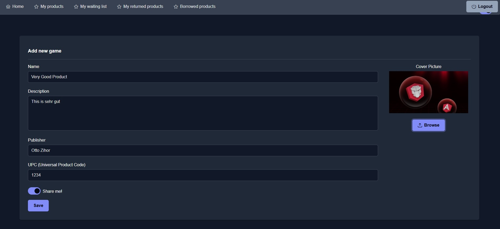
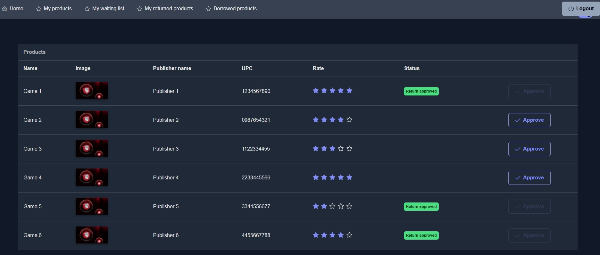
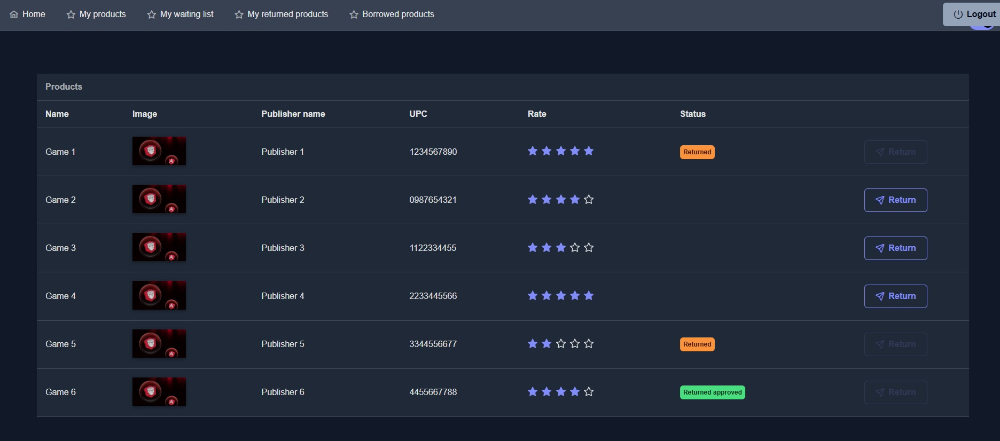

<<<<<<< HEAD
# BeChangerApp

## English

### Overview

BeChangerApp is an application for an online product exchange system.

### 🧱 Project Structure

The repository is organized into several key directories:

- **backend/**: Contains the server-side logic, including API endpoints and business logic.
- **frontend/**: Houses the client-side application, built with modern web technologies.
- **docker/**: Includes Docker-related files for containerization.
- **keycloak/**: Holds configurations related to Keycloak for authentication and authorization.
- **users/**: Manages user-related functionalities and data.

### 🛠️ Technologies Used

- **Backend**: Java (Spring Boot)
- **Frontend**: TypeScript, Angular
- **Authentication**: Keycloak
- **Containerization**: Docker
- **Others**: Docker Compose, Fly.io for deployment

### 🖼️ Project Screenshots

Below are some screenshots illustrating the project:













### 🚀 Local Setup – Step by Step

1. **Clone the repository**

   ```bash
   git clone <repo-url>
   cd BeChangerApp
   ```

2. **Backend (Spring Boot)**

   - Navigate to the `backend` directory:
     ```bash
     cd backend
     ```
   - Configure your PostgreSQL connection in `src/main/resources/application.properties`.
   - Start PostgreSQL locally or with Docker:
     ```bash
     docker run --name bechanger-postgres -e POSTGRES_PASSWORD=yourpassword -e POSTGRES_DB=bechanger -p 5432:5432 -d postgres
     ```
   - Build and run the backend:
     ```bash
     ./mvnw spring-boot:run
     ```
   - The backend runs on [http://localhost:8080](http://localhost:8080).

3. **Frontend (Angular)**

   - Navigate to the `frontend` directory:
     ```bash
     cd ../frontend
     ```
   - Install dependencies:
     ```bash
     npm install
     ```
   - Start the frontend:
     ```bash
     ng serve
     ```
   - The app runs on [http://localhost:4200](http://localhost:4200).

4. **Keycloak (Authentication)**

   - Navigate to the `keycloak` directory:
     ```bash
     cd ../keycloak
     ```
   - Start Keycloak with Docker:
     ```bash
     docker-compose up
     ```
   - Import the realm configuration from `keycloak/realm/be-changer.json`.

5. **Usage**
   - Open the frontend in your browser.
   - Ensure the backend and Keycloak are running for full functionality.

---

## Deutsch

### Überblick

BeChangerApp ist eine Anwendung für ein Online-Produkttauschsystem.

### 🧱 Projektstruktur

Das Repository ist in mehrere wichtige Verzeichnisse unterteilt:

- **backend/**: Enthält die serverseitige Logik, einschließlich API-Endpunkten und Geschäftslogik.
- **frontend/**: Beinhaltet die clientseitige Anwendung, die mit modernen Webtechnologien erstellt wurde.
- **docker/**: Enthält Docker-bezogene Dateien für die Containerisierung.
- **keycloak/**: Beinhaltet Konfigurationen im Zusammenhang mit Keycloak für Authentifizierung und Autorisierung.
- **users/**: Verwalten von benutzerbezogenen Funktionen und Daten.

### 🛠️ Verwendete Technologien

- **Backend**: Java (Spring Boot)
- **Frontend**: TypeScript, Angular
- **Authentifizierung**: Keycloak
- **Containerisierung**: Docker
- **Sonstiges**: Docker Compose, Fly.io für die Bereitstellung

### 🖼️ Projekt-Screenshots

Unten sind einige Screenshots, die das Projekt veranschaulichen:


### 🚀 Lokale Einrichtung – Schritt für Schritt

1. **Repository klonen**

   ```bash
   git clone <repo-url>
   cd BeChangerApp
   ```

2. **Backend (Spring Boot)**

   - Wechsle in das Verzeichnis `backend`:
     ```bash
     cd backend
     ```
   - Konfiguriere deine PostgreSQL-Verbindung in `src/main/resources/application.properties`.
   - Starte PostgreSQL lokal oder mit Docker:
     ```bash
     docker run --name bechanger-postgres -e POSTGRES_PASSWORD=deinpasswort -e POSTGRES_DB=bechanger -p 5432:5432 -d postgres
     ```
   - Baue und starte das Backend:
     ```bash
     ./mvnw spring-boot:run
     ```
   - Das Backend läuft auf [http://localhost:8080](http://localhost:8080).

3. **Frontend (Angular)**

   - Wechsle in das Verzeichnis `frontend`:
     ```bash
     cd ../frontend
     ```
   - Installiere die Abhängigkeiten:
     ```bash
     npm install
     ```
   - Starte das Frontend:
     ```bash
     ng serve
     ```
   - Die App läuft auf [http://localhost:4200](http://localhost:4200).

4. **Keycloak (Authentifizierung)**

   - Wechsle in das Verzeichnis `keycloak`:
     ```bash
     cd ../keycloak
     ```
   - Starte Keycloak mit Docker:
     ```bash
     docker-compose up
     ```
   - Importiere die Realm-Konfiguration aus `keycloak/realm/be-changer.json`.

5. **Benutzung**
   - Öffne das Frontend in deinem Browser.
   - Stelle sicher, dass das Backend und Keycloak laufen, um die volle Funktionalität zu gewährleisten.